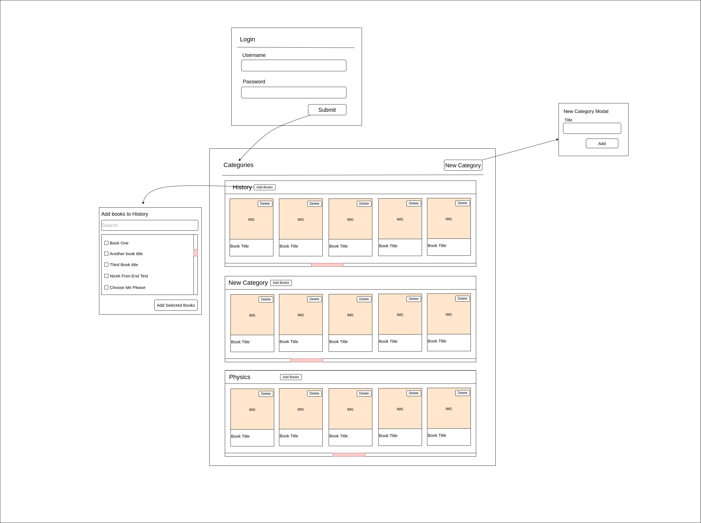

# Nizek Test Project

## Basic Details

This is an empty UI project, just to test your Front-End development skills.

A simple(Mock) API is implemented into the `server` directory. Please take a look at this directory and files.



## What do we need?

### Login

- Create Login Page UI(username, password)
- Implement UI Form validation
- Submit the form and call the Login API
- If the API call failed to show a toast message
- If the API call succeeded, save the user data in the local storage and navigate to the categories page.

### Category of books

- Check the local storage just a signed-in user has access to this page
- Show the list of categories(based on the sketch) (there is no API for a list of categories! So just show an empty list for the first time and handle this list as a UI component)
- By clicking on create category open a Modal or another page or show an inline component for adding a new category(just by entering the category title)
- Each category has a child component for a list of books(based on the sketch)
- Implement a modal(or another page or an inline component) to add books to the category. This component will call the books API and show the result, the user can search books locally, choose one or more books and click on the add button(then add books to the category)
- prevent adding a duplicate book to each category, a book can exist in multiple categories
- each book card has a delete button(which shows a confirm modal or another way for confirmation) and removes the book form category

### How to run the project?

After installing packages with npm or yarn, start the API or React project by running included scripts in the package.json file.

API:

`yarn server` port: 9000

UI:

`yarn start` port: 3000

List of provided APIs:

### Login:

`[POST] localhost:9000/auth/login`

```
//Request Body:
{
    username:"string", //arman
    password:"string" //123456
}
//response:
//Success:
{
    hasError: false,
    message: "Successful",
    payload:{
        id:1,
        username:"arman",
        fullName:"Arman Hoseini"
    }
}
//Failure:
{
    hasError: true,
    message: "Password is wrong"
}
```

### Get list of books:

`[GET] localhost:9000/books`

```
//response
{
    hasError:false,
    payload:[{
        id:1,
        title:"Clean Code",
        author:"Robert Cecil Martin",
        thumbnail:"https://picsum.photos/id/236/200/300"
    }]
}
```

# What is important?

- Your handwriting! :)
- Folder Structure
- Thinking in React
- Variable Names
- Use Context API as global state management
- Use Context API for categories component
- Use functional components
- use React Hooks
- You can choose Fetch API or Axios for API Calls
- You can implement the project using a UI Kit but it`s better to implement all components without any UI Kit.
- You can choose your interested styling method(CSS, SCSS, styled components, JSS)

`Our estimation is 4 or 5 hours.`
